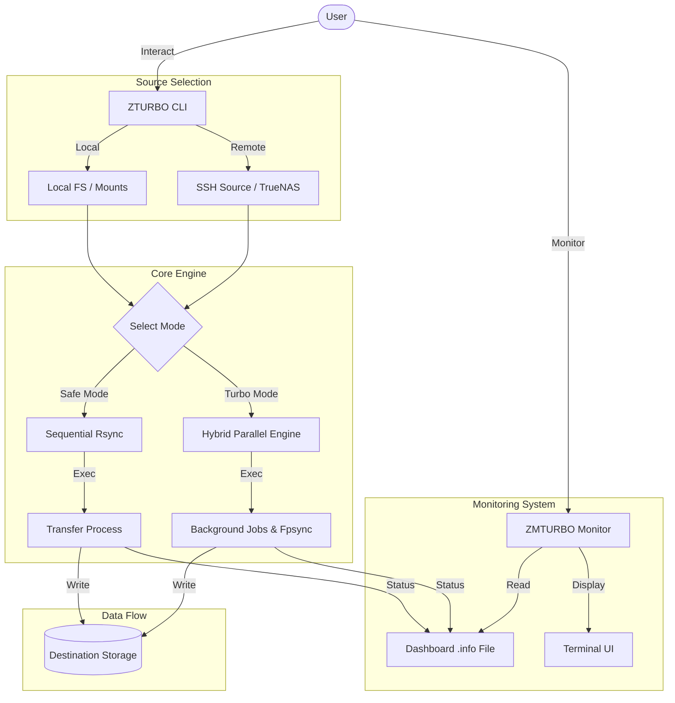
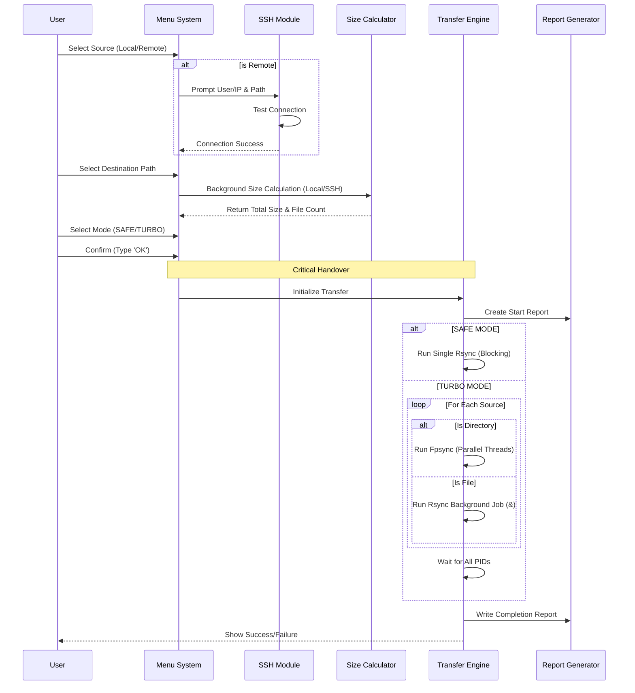
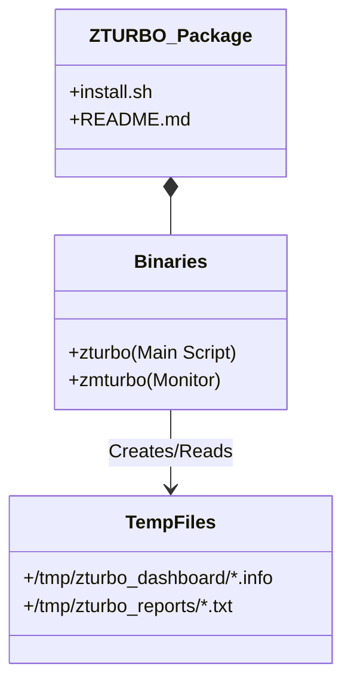

# ZTURBO Architecture Blueprint

## 1. High-Level Overview

ZTURBO is designed as a modular shell-based application that leverages native Linux tools (`rsync`, `fpsync`, `du`, `find`) to perform high-performance data transfers. It separates the "Transfer Logic" from the "Monitoring Logic" to ensure stability and responsiveness.

## 2. Transfer Execution Flow (Main Logic)

The core logic of `zturbo` handles user input, path selection, and mode switching before initiating the actual data movement.

## 3. Remote SSH Integration

ZTURBO V1.3.4 introduces native SSH integration for remote sources.

*   **Connection Handling**: Uses standard SSH with `ConnectTimeout` and `BatchMode` checks.
*   **Remote Metadata**: Executes `du` over SSH to calculate source sizes before transfer.
*   **Data Pathing**: Automatically translates selected remote paths into `user@ip:path` format for `rsync` and `fpsync`.
*   **Security**: Leverages existing SSH key-based authentication for seamless non-interactive transfers.

## 4. Directory Structure & Components

